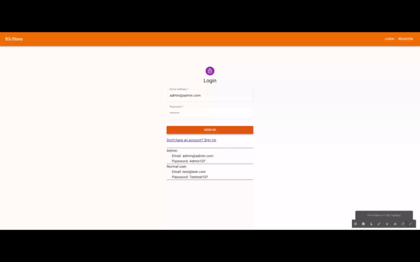

<a name="readme-top"></a>
 
 
<!-- PROJECT LOGO -->
<br />
<div align="center">
   
  <a href="https://bs-store-fullstack-render.onrender.com">
    
  </a>

  <h3 align="center">Front end of the Full stack Stock App</h3>

  <p align="center">
    An awesome Stock App
    <!-- <a href="https://github.com/ibrsec/stock-app"><strong>Explore the docs »</strong></a> -->
    <br />
    <br />
    <a href="https://bs-store-fullstack-render.onrender.com/">View Demo</a>
    ·
    <a href="https://github.com/ibrsec/bs-store-fullstack-render/issues">Report Bug</a>
    ·
    <a href="https://github.com/ibrsec/bs-store-fullstack-render/issues">Request Feature</a>
  </p>
</div>


<!-- TABLE OF CONTENTS -->
<details>
  <summary>📎 Table of Contents 📎 </summary>
  <ol>
    <li><a href="#about-the-project">About The Project</a></li>
     <!-- <li><a href="#figma">Figma</a></li> -->
     <li><a href="#overview">Overview</a></li>
     <li><a href="#quick-setup">Quick Setup</a></li>
     <li><a href="#directory-structure">Directory structure</a></li>
     <li><a href="#built-with">Built With</a></li>
    <!-- <li>
      <a href="#getting-started">Getting Started</a>
      <ul>
        <li><a href="#prerequisites">Prerequisites</a></li>
        <li><a href="#installation">Installation</a></li>
      </ul>
    </li>
    <li><a href="#usage">Usage</a></li>
    <li><a href="#roadmap">Roadmap</a></li>
    <li><a href="#contributing">Contributing</a></li>
    <li><a href="#license">License</a></li>
    <li><a href="#contact">Contact</a></li>
    <li><a href="#acknowledgments">Acknowledgments</a></li> -->

    
  </ol>
</details>


---

<!-- ABOUT THE PROJECT -->
<a name="about-the-project"></a>
## ℹ️ About The Project

[](https://bs-store-fullstack-render.onrender.com/)


<p align="right">(<a href="#readme-top">back to top</a>)</p>


---

<!-- ## Figma 

<a href="https://www.figma.com/file/ePyCHKsx2ODB32uLgyUEEd/bootstrap-home-page?type=design&node-id=0%3A1&mode=design&t=edDzadCB9Ev5FS1a-1">Figma Link</a>  

  <p align="right">(<a href="#readme-top">back to top</a>)</p>


--- -->
<a name="overview"></a>
## 👀 Overview

📦 Frontend of the my [bs-store-fullstack-render](https://github.com/ibrsec/bs-store-fullstack-render) project </br>
FRONTEND:

<b>🎯 React Development:</b> Built a responsive frontend using React.js, ensuring a seamless user experience.</br>

<b>🛠 State Management:</b> Managed application state with Redux Toolkit and Redux Persist, providing consistent state management across sessions.</br>

<b>🚀 Routing:</b> Integrated React Router DOM for smooth navigation between key pages like login, product listings, and admin dashboard.</br>

<b>🔒 Authentication:</b> Implemented JWT token authentication for secure user login and access control.</br>

<b>🔩 CRUD Operations:</b> Enabled full CRUD operations for products and categories, accessible to admin users only.</br>

<b>🔔 User Notifications:</b> Integrated React Toastify for real-time feedback on user actions such as login, registration, and CRUD operations.</br>

<b>💪 User Roles:</b> Normal users can only list products, while admin users have full access to create, update, and delete products and categories.</br>

<b>🌱 Admin Access:</b> Admin credentials are pre-populated on the login page for easy access to administrative functions.</br></br>


<p align="right">(<a href="#readme-top">back to top</a>)</p>


<a name="quick-setup"></a>
## 🛫 Quick Setup

```sh
# clone the project
git clone https://github.com/ibrsec/bs-store-fullstack-render.git

# enter the project directory
cd bs-store-fullstack-render

# install dependency
# linux
npm run setup-production
# windows
npm run setup-production-windows

# run
node index.js

```

<p align="right">(<a href="#readme-top">back to top</a>)</p>


<!-- ## 🐞 Debug

 -->


<a name="directory-structure"></a>
## 📂 Directory structure 

```diff
+ bs-store-frontend  (folder)
      |          
      |---public (folder) 
      |                
+     |---src (folder) 
      |     |---pages (folder)       
      |     |           
      |     |---components (folder) 
      |     |    
      |     |---app (folder)       
      |     |     └---store.jsx       
      |     |          
      |     |---router (folder)           
      |     |          
      |     |---services (folder)              
      |     |          
      |     |---helper (folder)        
      |     |---App.js 
      |     └---Index.js
      |      
      |----package.json
      |----.gitignore
      |----yarn.lock
      |----.env
      └----readme.md 
```

<p align="right">(<a href="#readme-top">back to top</a>)</p>

---

<a name="built-with"></a>
### 🏗️ Built With

 
<!-- https://dev.to/envoy_/150-badges-for-github-pnk  search skills-->

 
  
  
 <!--   -->
 <!--   -->
 <!--   -->
  
 <!--   -->
  
 <!--   -->

    
  
  
 <!--   -->


  

 <!--   -->

  
 <!--   -->
 <!--   -->
 <!--   -->
  
 


 
<p align="right">(<a href="#readme-top">back to top</a>)</p>


