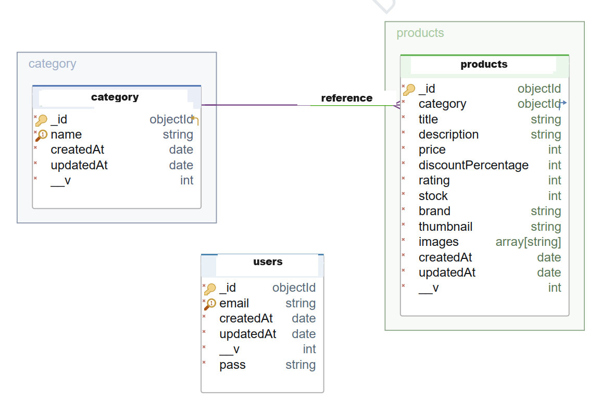

<a name="readme-top"></a>
 
 
<!-- PROJECT LOGO -->
<br />
<div align="center">
   
  <a href="https://bs-store-backend.vercel.app/api-doc/">
    
  </a>

  <h3 align="center">BS Store backend | Fullstack</h3>

  <p align="center">
    An awesome backend of the BS Store fullstack application
    <a href="https://github.com/ibrsec/bs-store-backend"><strong>Explore the docs »</strong></a>
    <br />
    <a href="https://bs-store-backend.vercel.app/api-doc/">Backend Swagger</a>
    <br />
    ·
    <a href="https://bs-store-frontend.vercel.app">Frontend Live Link</a>
    ·
    <a href="https://github.com/ibrsec/bs-store-frontend">frontend Repo</a>
    ·
    <a href="https://github.com/ibrsec/bs-store-backend/issues">Report Bug</a>
    ·
    <a href="https://github.com/ibrsec/bs-store-backend/issues">Request Feature</a>
  </p>
</div>


<!-- TABLE OF CONTENTS -->
<details>
  <summary>📎 Table of Contents 📎 </summary>
  <ol>
    <li><a href="#about-the-project">About The Project</a></li>
    <li><a href="#erd">ERD</a></li>
     <!-- <li><a href="#figma">Figma</a></li> -->
     <li><a href="#overview">Overview</a></li>
     <li><a href="#quick-setup">Quick Setup</a></li>
     <li><a href="#directory-structure">Directory structure</a></li>
     <li><a href="#built-with">Built With</a></li>
    <!-- <li>
      <a href="#getting-started">Getting Started</a>
      <ul>
        <li><a href="#prerequisites">Prerequisites</a></li>
        <li><a href="#installation">Installation</a></li>
      </ul>
    </li>
    <li><a href="#usage">Usage</a></li>
    <li><a href="#roadmap">Roadmap</a></li>
    <li><a href="#contributing">Contributing</a></li>
    <li><a href="#license">License</a></li>
    <li><a href="#contact">Contact</a></li>
    <li><a href="#acknowledgments">Acknowledgments</a></li> -->

    
  </ol>
</details>


---

<!-- ABOUT THE PROJECT -->
<a name="about-the-project"></a>
## ℹ️ About The Project

[](https://bs-store-backend.vercel.app/api-doc/)

<!-- ERD OF THE PROJECT -->
<a name="erd"></a>
## ℹ️ ERD
[](https://bs-store-backend.vercel.app/api-doc/)


<p align="right">(<a href="#readme-top">back to top</a>)</p>


---

<!-- ## Figma 

<a href="https://www.figma.com/file/ePyCHKsx2ODB32uLgyUEEd/bootstrap-home-page?type=design&node-id=0%3A1&mode=design&t=edDzadCB9Ev5FS1a-1">Figma Link</a>  

  <p align="right">(<a href="#readme-top">back to top</a>)</p>


--- -->
<a name="overview"></a>
## 👀 Overview

📦 Backend of the    <a href="https://github.com/ibrsec/bs-store-front">bs-store-frontend</a> project  for store data </br>
🎯 Used express, dotenv, express-async-errors,jsonwebtoken, mongoose, swagger-jsdoc, swagger-ui-express,cors </br>
🖥 MongoDb is used as db </br>
🔩 Jwt token authentication is use for authorization an authentication operations </br>
<!-- 🖥 --</br> -->
💪 Normal users can only list the products</br>
🌱 Admin user can list create update and delete the products and categories of the products</br>
 <!-- 🐞 ---  </br> -->
<!-- 🏀 --- </br> -->
<!-- 🌱  ---</br>   -->
</br>


<p align="right">(<a href="#readme-top">back to top</a>)</p>


<a name="quick-setup"></a>
## 🛫 Quick Setup

```sh
# clone the project
git clone https://github.com/ibrsec/bs-store-backend.git

# enter the project directory
cd bs-store-backend

# install dependency
npm install 

# develop
npm run start 
```

<p align="right">(<a href="#readme-top">back to top</a>)</p>


<!-- ## 🐞 Debug

 -->


<a name="directory-structure"></a>
## 📂 Directory structure 

```diff
+ bs-store-backend  (folder)     
+     |---src (folder) 
      |     |---config (folder)       
      |     |           
      |     |---controller (folder) 
      |     |    
      |     |---helpers (folder)      
      |     |          
      |     |---models (folder)           
      |     |          
      |     |---routes (folder)              
      |     |          
      |     └---helper (folder)  
      |      
      |----.env
      |----.gitignore
      |----package.json
      |----vercel.json
      └----readme.md 
```


<p align="right">(<a href="#readme-top">back to top</a>)</p>

---

<a name="built-with"></a>
### 🏗️ Built With

 
<!-- https://dev.to/envoy_/150-badges-for-github-pnk  search skills-->

 <!--  -->
 <!--   -->
  
 <!--   -->
 <!--   -->
 <!--   -->
 <!--   -->
 <!--   -->
 <!--   -->
 <!--   -->

  <!--    -->
 <!--   -->
 <!--   -->
 <!--   -->


 <!--   -->

 <!--   -->

 <!--   -->
 <!--   -->
 <!--   -->
 <!--   -->
 <!--   -->
  
  
  
  
  
 

  


 
<p align="right">(<a href="#readme-top">back to top</a>)</p>


